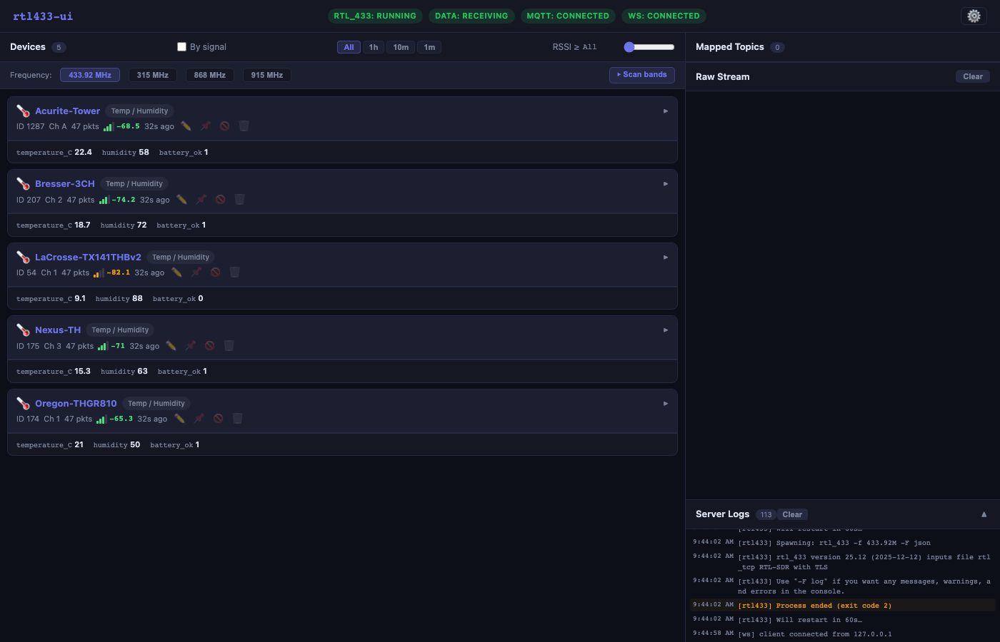
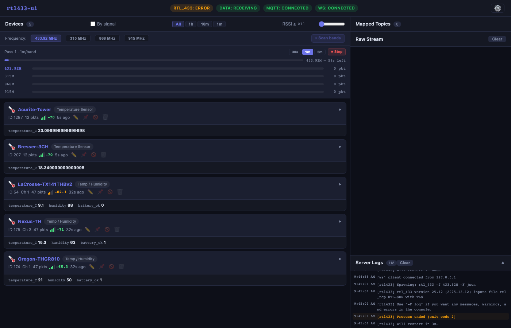
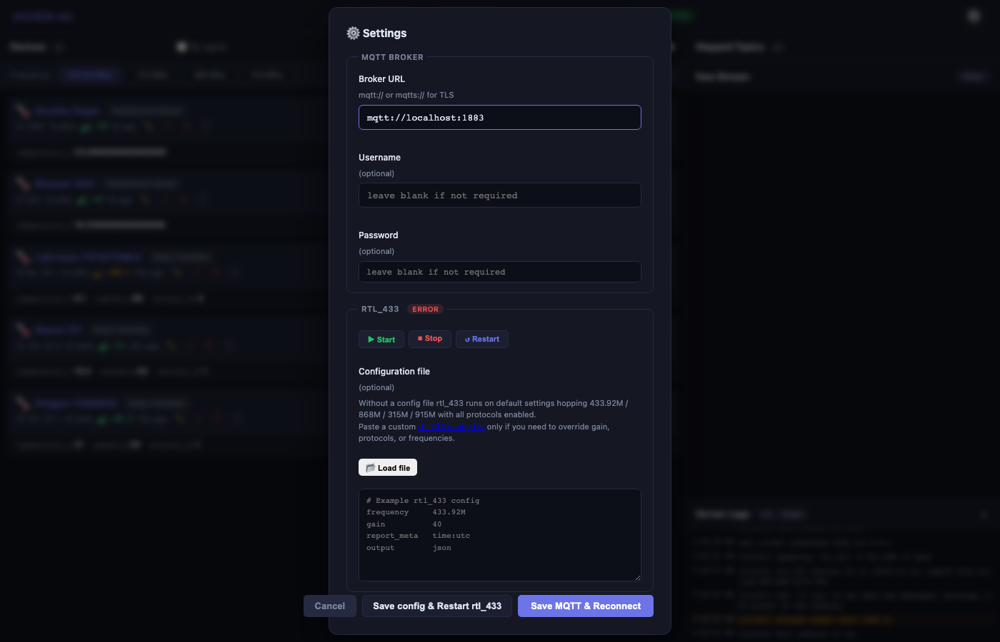

# RTL433-UI

A live web dashboard for RTL-SDR receivers that decodes 433 / 315 / 868 / 915 MHz signals using the bundled [rtl_433](https://github.com/merbanan/rtl_433) binary, displays every detected device in real time, and lets you map any sensor field to an MQTT topic — including one-click Home Assistant auto-discovery.

> **No separate rtl_433 add-on required.** The decoder binary is bundled inside this image.

---

## Requirements

- An RTL-SDR dongle (RTL2832U chipset) plugged into your Home Assistant host
- The **Mosquitto broker** add-on (or any MQTT broker reachable from the add-on)

---

## Installation

1. Go to **Settings → Add-ons → Add-on Store**
2. Click **⋮** (top right) → **Repositories**
3. Add: `https://github.com/dalekunce/rtl433-ui`
4. Find **RTL433-UI** and click **Install**
5. Start the add-on — the web UI appears in the HA sidebar immediately

---

## Configuration options

| Option | Default | Description |
|--------|---------|-------------|
| `mqtt_url` | `mqtt://core-mosquitto:1883` | MQTT broker URL. Use `mqtts://` for TLS. |
| `mqtt_username` | *(blank)* | MQTT username. Leave blank if your broker has no auth. |
| `mqtt_password` | *(blank)* | MQTT password. |
| `mqtt_topic_prefix` | `rtl_433` | Prefix for the MQTT topics rtl_433 publishes to. Change only if you've customised your broker. |
| `mqtt_command_topic` | `rtl_433/command` | Topic used to send frequency commands to rtl_433. |

All settings can also be changed live from the in-app **Settings ⚙** panel without restarting the add-on.

---

## First start

On first start the add-on:

1. Starts the rtl_433 binary scanning **all four ISM bands** (433.92 / 868 / 315 / 915 MHz) with all 191 device protocols enabled — no configuration needed
2. Connects to your MQTT broker
3. Opens the web UI at the **RTL433-UI** sidebar entry

Within 30–90 seconds you should see device cards appear for any 433 MHz transmitters nearby (weather stations, door sensors, temperature probes, etc.).

---

## Dashboard overview

### Status bar

At the top of the page four status badges show at a glance:

| Badge | Meaning |
|-------|---------|
| `rtl_433: running` | The rtl_433 subprocess is active and scanning |
| `data: receiving` | Packets are being decoded (green after first packet) |
| `MQTT: connected` | Broker connection is live |
| `WS: connected` | Browser is receiving live updates |

### Device cards

Each decoded device gets a card showing:
- **Model name** and device ID
- **All sensor fields** (temperature, humidity, battery, RSSI, …)
- **Last seen** time and signal count
- **Sparkline** history chart for numeric fields
- **Map →** button to assign a field to an MQTT topic
- **Pin**, **Ignore**, and **Label** actions

Click a card header to expand it and see full field details with mapping controls.

### Frequency toolbar

Quick-switch between bands. The active band is highlighted. Use **⏵ Scan bands** to run a persistent multi-band scan that accumulates packet counts over time to find which band has the most activity in your environment.

### Raw stream (right panel)

Live JSON packet stream. Click any entry to highlight the matching device card.

### Server logs (right panel, below stream)

Real-time output from the rtl_433 process and the Node.js server. Click the **Server Logs** header to expand the panel to full height.

---

## MQTT topic mapping

1. Expand a device card
2. Click **Map →** next to any field
3. Choose a topic template or type your own
4. Click **Save** — that field will be published to MQTT every time the device transmits

### Templates

| Template | Example output |
|----------|----------------|
| Flat | `rtl433/Acurite-Tower/1234/temperature_C` |
| HA state | `homeassistant/sensor/rtl433_Acurite-Tower_1234/temperature_C/state` |
| HA auto-discovery ✦ | Publishes a full HA discovery config then saves the state topic |

### HA auto-discovery

Click **HA auto-discovery ✦** to publish a complete MQTT discovery payload. Home Assistant will immediately create an entity for that field with the correct device class, unit, and state topic — no YAML required.

For `battery_ok`, `alarm`, and `tamper` fields the add-on automatically uses the `binary_sensor` domain.

For ERT/AMR utility meters the `state_class` is set to `total_increasing` for correct Energy Dashboard integration.

---

## Band scanner

Click **⏵ Scan bands** in the frequency toolbar to start a persistent scan:

- Cycles through 433.92 → 315 → 868 → 915 MHz continuously
- Accumulates packet counts across multiple passes
- Live progress bar shows time remaining in the current window
- Choose **30s**, **1m** (default), or **5m** per band
- The band with the most packets is highlighted green
- Click **⏹ Stop** to freeze and review results

Useful for new installations to confirm which band your devices use.

---

## Custom rtl_433 config

For advanced tuning (specific gain, protocol allowlist, non-standard frequencies):

1. Open **Settings ⚙** → **rtl_433 config** section
2. Paste your `rtl_433.conf` content into the text area (or load a file from disk)
3. Click **Save & restart**

The config is saved to `/data/rtl_433.conf` and persists across restarts and updates. Delete the file (or clear the text area and save) to return to the default multi-band scan.

Reference: [rtl_433 configuration documentation](https://triq.org/rtl_433/OPERATION.html#configuration-file)

---

## Filters

### RSSI filter

Use the **RSSI** slider to hide weak signals. Useful if you're picking up distant neighbours' sensors you don't care about. `-80 dBm` is a good starting point; lower = more sensitive.

### Age filter

The **Age** buttons (All / 1h / 24h / 7d) hide devices not seen recently.

---

## Device management

- **Pin** — moves the device to the top of the list permanently
- **Ignore** — hides the device from the list (reversible via Settings)
- **Label** — assigns a human-readable name displayed on the card
- **Forget** — removes the device from the in-memory list immediately

---

## Troubleshooting

### `rtl_433: stopped` / `rtl_433: error`

The rtl_433 subprocess failed to start or crashed. Common causes:

1. **Dongle not detected** — check it's physically connected; try unplugging and re-plugging
2. **Another process has the dongle** — only one process can claim the USB device at a time. Check if another add-on (e.g. the original rtl_433 add-on) is running and stop it
3. **USB device permissions** — rare on HA OS, but check the add-on log for `libusb` errors

Open **Server Logs** in the sidebar to see the exact error message from rtl_433.

### `MQTT: disconnected`

- Confirm the Mosquitto add-on is running
- Check `mqtt_url` matches your broker address
- If your broker has auth, verify `mqtt_username` and `mqtt_password`

### No devices appearing

- Confirm rtl_433 is showing `running` (not just `starting`)
- Try the **Scan bands** tool to find which frequency has activity
- Press a wireless doorbell button or car key fob near the dongle as a quick test — you should see a packet within seconds

---

## Support

- **Issues / feature requests**: [github.com/dalekunce/rtl433-ui/issues](https://github.com/dalekunce/rtl433-ui/issues)
- **Source code**: [github.com/dalekunce/rtl433-ui](https://github.com/dalekunce/rtl433-ui)
